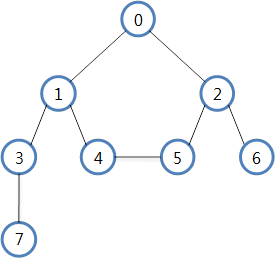
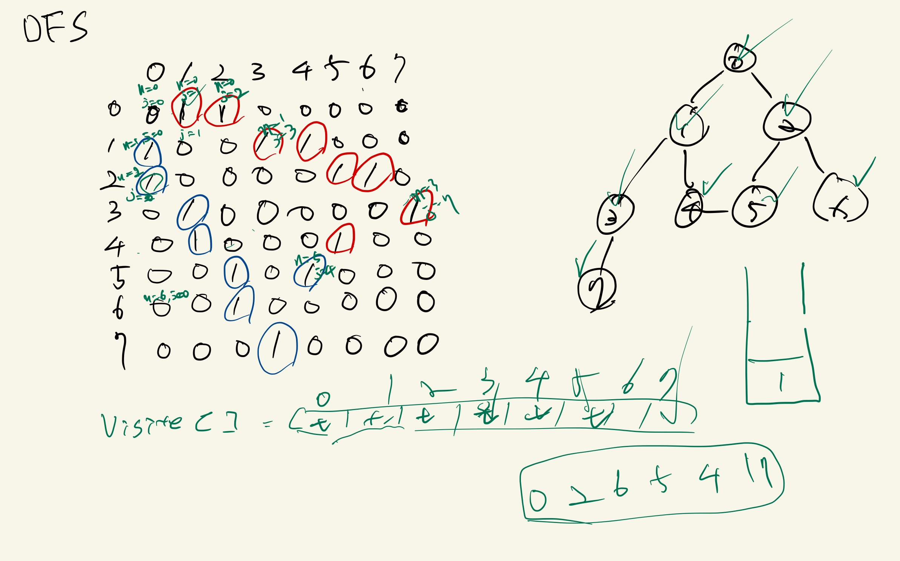

# 04. DFS(Depth - First Search)와 BFS(Breadth - First Search)

## 그래프 탐색




### 그래프를 matrix로 표현하기

```java
public class UndirectedGraph{
    private int count;            
    private int[][] vertexMatrix;  
    
    
    public UndirectedGraph(int count){
        this.count = count;
        vertexMatrix = new int[count][count];
    }

    public void addEdges(int from, int to, int weight){
    	vertexMatrix[from][to] = weight;
    	vertexMatrix[to][from] = weight;
    }
    
    public int[][] getMatrix(){
    	return vertexMatrix;
    }
}
```

### 깊이 우선 탐색(DFS)

- 인접한 노드를 우선 탐색 하는 방식
- 스택을 활용하여 구현할 수 있음
- DFS 탐색 순서 :
  0 - 1 - 3 - 7 - 4 - 5 - 2 - 6 or
  0 - 2 - 6 - 5 - 4 - 1 - 3 - 7
- undirect


### 너비 우선 탐색(BFS)

- 한 노들에 모든 인접한 노드를 탐색하는 방식
- 큐를 활용하여 구현할 수 있음
- BFS 탐색 순서 : 0 - 1 - 2 - 3 - 4 - 5 - 6 - 7
- direct
