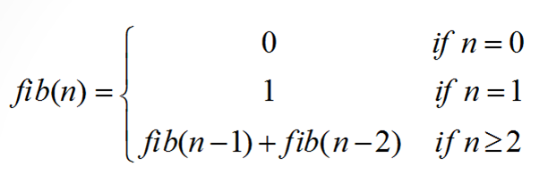
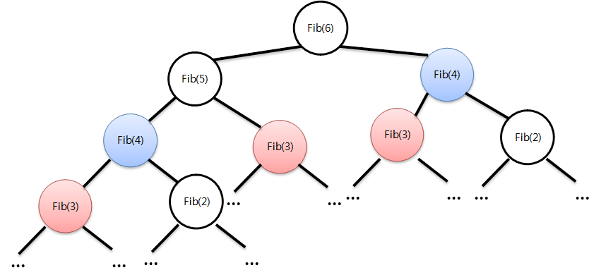
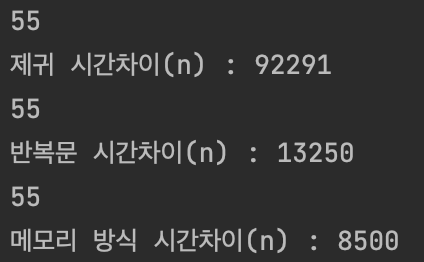

# 07. 피보나치 수열 문제 여러 방식으로 해결하기








## 재귀 함수로 풀이하기

```java
public int fibonacciRecur(int n) {
		

		if (n == 0) return 0;
		if (n == 1) return 1;

		return fibonacciRecur(n - 1) + fibonacciRecur(n - 2);
}
```

## 반복문으로 풀이하기

```java
public int fibonacciIter(int n) {

		int ppre = 0;
		int pre = 1;
		int current = 0;

		if (n == 0) return 0;
		if (n == 1) return 1;

		for (int i = 2; i <= n; i++) {
			
			current = ppre + pre;
			ppre = pre;
			pre = current;	
		}

		return current;
}
```

## 메모이제이션 

```java
public int fibonacciMem(int n) {

		value[0] = 0;
		value[1] = 1;
		
		if (n == 0) {
			return value[0];
		}
			
		if (n == 1) {
			return value[1];
		}
		
		int i;
		for( i = 2; i<=n; i++) {
			
			value[i] = value[i-1] + value[i-2];
	
		}
		
		return value[i-1];
}
```
## 실행 코드

```java
public static void main(String[] args) {

        Fibonacci fib = new Fibonacci(100);

        long beforeTime = System.nanoTime();
        int result = fib.fibonacciRecur(10);
        System.out.println(result);
        long afterTime = System.nanoTime();
        long secDiffTime = (afterTime - beforeTime);
        System.out.println("제귀 시간차이(n) : "+secDiffTime);

        beforeTime = System.nanoTime();
        result = fib.fibonacciIter(10);
        System.out.println(result);
        afterTime = System.nanoTime();
        System.out.println("반복문 시간차이(n) : " + (afterTime - beforeTime));

        beforeTime = System.nanoTime();
        result = fib.fibonacciMem(10);
        System.out.println(result);
        afterTime = System.nanoTime();
        System.out.println("메모지에션 방식 시간차이(n) : " + (afterTime - beforeTime));
}
```
## 결과

